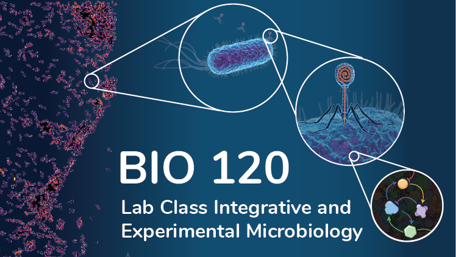

----

About
=====

Welcome to the website of BIO120: Integrative and Experimental Microbiology! 

You are reading the spring quarter 2024 edition.

In this laboratory course, we explore the fascinating world of microbial cells and phages through the lenses of experiments and theory. Experiments include the quantification of microbial growth and phage counts, the tracking of phage infection dynamics, and the homologous overexpression of proteins. Methods include classical plating and plaque assays, genetic manipulations, protein extraction, and mass-spec analysis. "Dry labs" accompany bench work to promote data analysis and further explore the link between molecular processes and microbial phenotypes.

A more detailed overview of course content and syllabus is provided on this website.

Sharon Long, Naima Sharaf, Mathis Leblanc, and Jonas Cremer

Palo Alto, February 2024

.. The following lines are necessary in RST to populate the side bar. In short,
   you should have each category

.. toctree::
   :maxdepth: 1
   :caption: Gallery
   
   materials/gallery.ipynb

.. toctree::
   :maxdepth: 1
   :caption: Syllabus & Policies

   syllabus
   policies
   instructors

.. toctree::
   :maxdepth: 1
   :hidden:
   :caption: Acknowledgements

 
   acknowledgements

.. toctree::
   :maxdepth: 0
   :hidden:
   :caption: License

   
   license

   